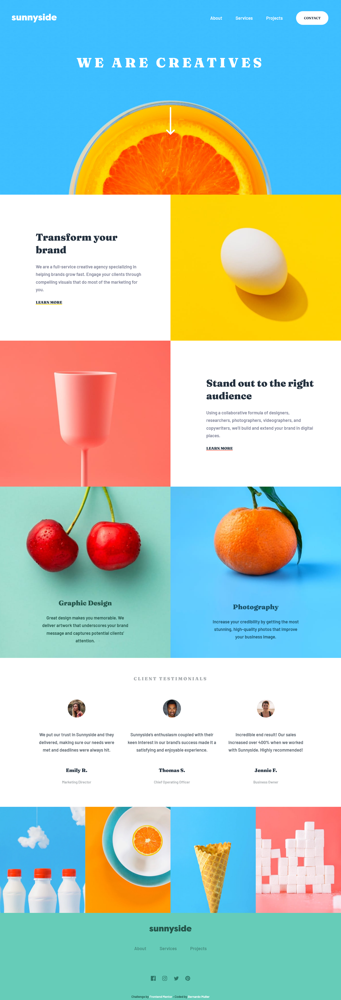
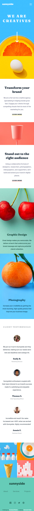

# Frontend Mentor - Sunnyside agency landing page

## The challenge

Your challenge is to build out this landing page and get it looking as close to the design as possible.

This challenge focuses mostly on HTML & CSS. There's a tiny bit of JS included for the mobile navigation toggle. But you could also choose to do this without JS!

You can use any tools you like to help you complete the challenge. So if you've got something you'd like to practice, feel free to give it a go.

Your users should be able to:

- View the optimal layout for the site depending on their device's screen size
- See hover states for all interactive elements on the page

### Screenshot

- Desktop Preview

- Mobile Preview

### Links

- [Live Site Link](https://sunnyside-landingpage-challenge-layout.netlify.app/)

## My process

- Work on the HTML
- Think about the Mobile Layout first and how to achieve it
- Get the mobile layout working and as close as possible to the challenge
- Include the Menu element
- Add the responsiveness and all the changes in a media query related to the desktop view
- Smoothing and refining everything

### Built with

- Semantic HTML5 markup
- CSS custom properties
- Flexbox
- CSS Grid
- Mobile-first workflow
- [Sass](https://sass-lang.com/)

### What I learned

- The basics of SASS
- Nesting in SASS is amazing
- To always work mobile-first, the layout is usually a lot easier to make and then you move to a more complicated layout later
- To avoid working with absolute measures, prefer to use dynamic in everything. Makes responsiveness a lot easier to achieve
- Only change things that are needed, the original HTML is usually very responsive by default
- Firefox is better than Chrome for dev work
- More media query stuff
- Adding a class to everything makes the CSS a lot easier to understand (Especially as things get bigger)
- Responsiveness in general, this project was an amazing way to work on it and get it to work
